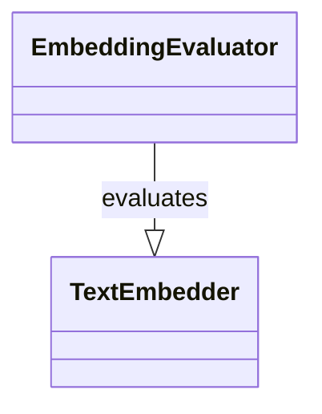

# Architecture Overview

## Important classes




Pretty simple.

## What happens in `main.py`

`main.py` is the entry point of the evaluation script.
You can specify the embedding model name as follows:

```bash
poetry run python main.py \
  --embedder SentenceBertEmbedder \
  --embedder.model_name_or_path "prajjwal1/bert-tiny" \
  --save_dir "output"
```

The overview of `main.py` is as follows:
- there are multiple `EmbeddingEvaluator` instances
- each `EmbeddingEvaluator` instance is responsible for evaluating `TextEmbedder` on a specific task and a dataset
- `EmbeddingEvaluator` outputs metrics and these results are logged

By default, those `EmbeddingEvaluator` instances are defined in `src/configs/jmteb.yaml`, which is parsed by [`jsonargparse`](https://github.com/omni-us/jsonargparse).
Please refer to the [official documentation](https://jsonargparse.readthedocs.io/en/stable/) to play around with different configurations.

## What happens in `EmbeddingEvaluator`

You can see the classes implementing `EmbeddingEvaluator` under `src/evaluators/` or `src/evaluators/__init__.py`.
These classes typically have some dataset to load instances.

`EmbeddingEvaluator` takes a `TextEmbedder` instance with `__call__`, and the following happens:
- extract text data from datasets and pass them to `TextEmbedder`
- get the embeddings from `TextEmbedder`
  - optionally cache the embeddings or load them from cache
- perform computation with the embeddings to solve the task
- compute metrics and return them